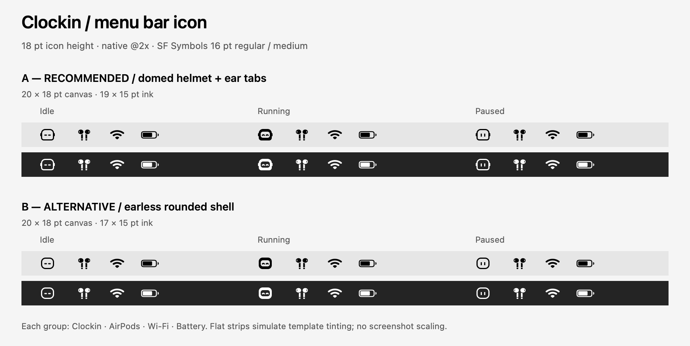

# Clockin menu bar icon

Implemented **A: domed helmet with small ear tabs** in `ClockinMac/MenuBarIcon.swift`.



## Change and dimensions

Removed the antenna and enlarged the helmet from **12.5 × 10 pt to 17 × 15 pt**. The broader crown, tighter lower corners, small ear tabs, and wide visor keep the mascot's helmet character. The outline and eye stroke is **1.5 pt**.

| Measurement | Default size |
| --- | --- |
| Returned image / layout canvas | **20 × 18 pt** |
| Geometric artwork bounds, including ears | **19 × 15 pt** |
| Helmet alone | **17 × 15 pt** |
| Running visor knockout | **12 × 8 pt** |
| Retina image canvas | **40 × 36 px** |

`image(_:pointSize:)` and the three states remain. `pointSize` specifies height; width is `pointSize * 20 / 18`. At the default `18`, allow **20 pt of image width**, plus the status button's normal padding. The existing controller uses `NSStatusItem.variableLength` and assigns the returned image directly, so its source needs no change.

- **Idle:** outlined helmet with closed, horizontal eyes.
- **Running:** solid helmet with a genuinely transparent visor and happy eye arcs.
- **Paused:** outlined helmet with two pause bars.

All states share the same outer bounds and remain vector-drawn template images. The knockout stays inside an isolated transparency layer, preserving the background underneath.

## Why A over B

The sheet's **B** uses an earless shell with uniform rounded corners, the same face drawings, and the same 15 pt helmet height. It is simpler, but its outline reads more like a generic rounded face or playback button. A's domed crown, tighter jaw, and ear tabs retain more of Clockin's mascot silhouette. The ears use horizontal room only; they do not shrink the helmet. The solid running state intentionally carries more weight than the two outlined states.

No disagreement with removing the antenna or the requested size. I interpret matching system icons as an **optical match**, not forcing every symbol to identical dimensions: AirPods, Wi-Fi, and battery naturally have different proportions. Their native aspect ratios are preserved in the comparison.

## Rendering and verification

The throwaway renderer is `/tmp/clockin-menubar-render.py`; it reads the actual production Swift file, derives B only in temporary source, compiles with AppKit, and writes `docs/codex/10-menubar-preview.png`. Neither renderer nor alternative code is added to the repository.

The sheet is **1800 × 904 px**, representing **900 × 452 pt at 2×**. Both designs show idle/running/paused on light and dark strips, each beside actual `airpods`, `wifi`, and `battery.75percent` SF Symbols. Symbols use **16 pt, regular weight, medium scale**, with native image sizes of 20 × 18, 22 × 15, and 28 × 13 pt respectively. All images are marked as templates and tinted through isolated alpha masks. View the PNG at 50% on a 1× screen for its intended point size.

Inspected the sheet and separate native **1× and 2×** renders, including enlarged raster views. All states have nonzero alpha bounds of 20 × 16 pixels at 1× (including antialiasing) and 38 × 30 pixels at 2×. No vertical clipping; the face details remain separated and the visor shows the strip color. Renderer assertions verified template flags, default dimensions, and proportional sizing at `pointSize: 36`.

Passed with exit code 0:

```sh
xcrun swiftc -typecheck \
  -sdk "$(xcrun --sdk macosx --show-sdk-path)" \
  -module-cache-path /tmp/clockin-menubar-module-cache \
  ClockinMac/MenuBarIcon.swift

python3 /tmp/clockin-menubar-render.py
git diff --check
```

Validation covers compilation and AppKit raster rendering. The strips simulate menu bar backgrounds; this is not a screenshot of the running app or a check of wallpaper-dependent system tinting.
