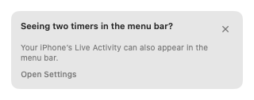
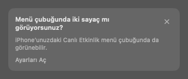

# 19: iPhone Live Activity settings tip

Implemented 2026-09-30.

## Behavior

Settings → Menu bar now explains the iPhone Live Activity beneath “Show details in the menu bar” and offers **Open iPhone notification settings**. Both this button and the tip use `IPhoneNotificationSettings.open()`:

1. `x-apple.systempreferences:com.apple.Notifications-Settings.extension?RemoteNotificationSettings`
2. If `NSWorkspace.open` returns false, `x-apple.systempreferences:com.apple.Notifications-Settings.extension`

Clockin does not change the system switch. The fallback is based on the URL opener's return value; it cannot detect a System Settings version accepting the URL but ignoring its anchor.

A compact **Seeing two timers in the menu bar?** card appears in the menu bar panel and above the timer on Today. It explains that the iPhone Live Activity can appear there too. **Open Settings** opens the same destination; the panel closes first. The close button dismisses both copies permanently on this Mac. Opening Settings leaves the card available until explicitly dismissed. Arrival never opens a window, panel or alert or requests focus.

Six English strings have Turkish translations in `Shared/Localizable.xcstrings`, including “menü çubuğu” and “Canlı Etkinlik”. The obsolete combined settings explanation was replaced; remaining translations and the catalog's sorted, two-space JSON serialization are unchanged.

## Detection and local state

`ClockStore` exposes two macOS-only, synchronous post-persistence events: successful local clock-in and successful synced running-session apply, including the previous/current sessions. `MacAppServices.start` attaches `MacLiveActivityTip` before the existing sync startup. `SyncCoordinator` and the sync core are unchanged.

A sync apply qualifies when it contains an active session with a different start from the previously visible session and from this Mac's latest successful local clock-in. Paused active sessions qualify too because their Live Activities can also mirror. Local clock-ins, same-session sync echoes, remote pause/resume of a local timer, nil timers, archive loading and failed persistence do not qualify. Merely observing the store's general data publication would also catch local writes and rollback states, so it is deliberately not the trigger.

`RunningSession` has no origin device ID. Its stable start time is the available identity for this presentation heuristic. An identical timer already loaded from an archive is conservatively ignored; the feature neither proves an iPhone was the sender nor detects whether mirroring is actually enabled. It makes no schema or sync protocol changes.

Production uses `UserDefaults.standard`, not the App Group or ubiquitous defaults:

- `Clockin.MacLiveActivityTipDismissed.v1`: permanent dismissal.
- `Clockin.MacLiveActivityTipPending.v1`: keeps undismissed advice available across relaunches.
- `Clockin.MacLiveActivityTipLocalStart.v1`: the latest successful local clock-in start, retained across relaunches to suppress its echo even after the visible timer has cleared.

All three keys are outside the sync preference allowlist. Both surfaces observe the same instance. The Today insertion and store events are guarded by `os(macOS)`; new feature files belong to the synchronized `ClockinMac` source folder. iPhone behavior is unchanged.

## Verification

- **43/43 README check commands passed**, including sync algebra/bounds/five-year simulation, codecs, send scheduling, real-store/fake-transport integration, and macOS/iOS Simulator strict concurrency type-checks. The initial run passed 24 commands; 19 failed before compilation because the default Swift module cache was outside the writable sandbox. Those same commands passed with only `-module-cache-path /tmp/clockin-19-readme-cache` added. Commands, exit codes and logs: `/tmp/clockin-19-readme-checks/`.
- **27/27 focused checks passed** via `Tests/manual/macliveactivitytip/run`, now listed in README. They use real stores and isolated defaults, exercise local/remote/paused/replaced sessions, relaunches, dismissal, independent defaults domains, failed saves, unchanged timer/no local-write echo, and anchored/fallback/both-failed URL opening. The runner compiles the actual card as well, with Swift 6 complete strict concurrency and warnings as errors.
- `MacSettingsSection`, the card, tip, opener and real store passed an additional type-check targeting arm64 macOS 14. Only unrelated updater, shortcut, desk-window, wardrobe-key and minimal-mode action dependencies used temporary boundary doubles.
- `xcstringstool compile` passed. Catalog checks verified all six translations, unchanged retained entries, normal serialization, and exclusion of all tip defaults keys from the sync allowlist.
- Changed integration views/services passed Swift parsing; `git diff --check` passed.
- Offscreen `NSHostingView` renders were inspected at 320 pt in English/light and Turkish/dark, plus 600 pt in Turkish/light. Text, close and Settings buttons fit without clipping. ImageRenderer alone could not render the native buttons, so its placeholder output was replaced by AppKit hosting-view captures.

English, menu-panel width:

Turkish, menu-panel width:

These are isolated card renders, not screenshots of the running application. No `xcodebuild`, signed two-device CloudKit run, or live System Settings navigation was performed. The anchored destination is the URL verified in the task; executable checks verify opener ordering and fallback, not the operating system's resulting page.
